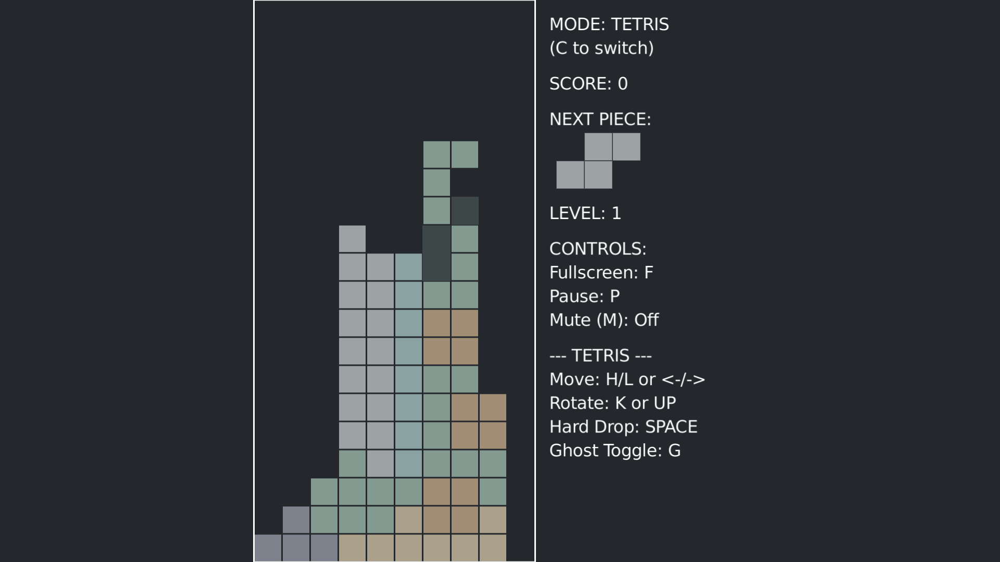
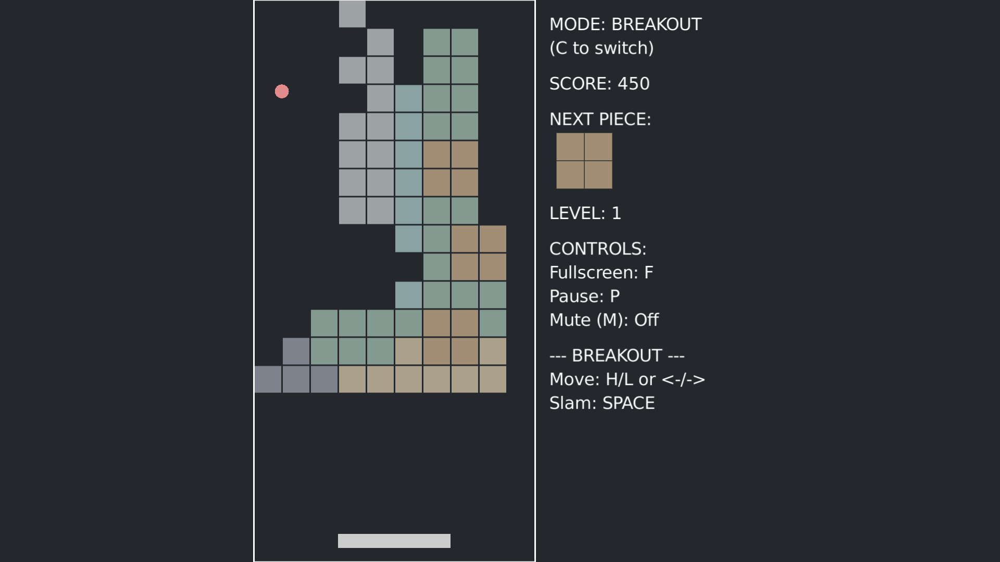

<p align="center">
  
  
  
  
  
</p>

---

# 🎮 Break Tetris — A Lua LÖVE Hybrid Game

> 一款把「俄羅斯方塊」與「打磚塊」融合在一起的創意遊戲實驗。  
> 用 Love2D 打造的像素級碰撞邏輯、平滑動畫與柔和莫蘭迪色系。

---

<p align="center">
  
  &nbsp;&nbsp;
  
</p>

---

## ✨ 專案介紹

**Break Tetris** 是一款使用 **Lua + LÖVE (Love2D)** 製作的混合型遊戲。  
它將經典的「Tetris」與「Breakout」兩種玩法合而為一：

- 玩家可以隨時按下 `C` 鍵，在「俄羅斯方塊」與「打磚塊」兩種模式間自由切換。
- 在打磚塊模式中，當你擊碎所有磚塊後，遊戲也會自動切換回俄羅斯方塊模式。

這不只是個小遊戲，而是一場關於「物理、節奏、與過渡動畫」的實驗。

---

## 🎮 下載遊戲 (Download Game)

您可以直接從下方的連結下載最新發佈的遊戲版本，無需自己編譯程式碼。

<p align="center">
  <a href="https://github.com/alvin999/BreakTetris/releases">
    
  </a>
</p>

---

## 📦 發佈版執行

如果你下載的是已打包的 Release 版本：

- **Windows**:
  1.  解壓縮 `break_tetris-win.zip`。
  2.  進入解壓縮後的資料夾，執行 `break_tetris.exe`。
  3.  如果遇到 Windows SmartScreen 警告，請點選「其他資訊」，然後點選「仍要執行」。

- **macOS**:
  1.  解壓縮 `break_tetris-mac.zip`。
  2.  直接執行 `break_tetris` 應用程式。 (如果遇到安全性警告，請在「系統設定」>「隱私權與安全性」中允許執行)

---

## 🧠 遊戲玩法

**通用操作:**
- **C**：切換遊戲模式 (TETRIS / BREAKOUT)
- **F**：全螢幕模式
- **P**：暫停遊戲
- **M**：切換音效

### 🎲 模式一：俄羅斯方塊 (TETRIS)

- **⬅️➡️ / H L**：移動方塊
- **⬆️ / K**：旋轉方塊
- **⬇️ / J**：軟降 (Soft Drop)
- **Space**：瞬間硬降 (Hard Drop)
- **G**：切換預覽方塊 (Ghost Piece) 顯示

### 🪓 模式二：打磚塊 (BREAKOUT)

- **⬅️➡️ / H L**：移動板子
- **Space**：加速擊打 (Slam)

---

## 🧩 核心特色

| 類別 | 說明 |
|------|------|
| 🎮 **雙模式玩法** | 支援 `TETRIS` ↔ `BREAKOUT` 雙向切換,含動畫過渡 |
| 🎨 **莫蘭迪色系** | 柔和低飽和的色調,打造沉靜與專注的遊玩氛圍 |
| 🧠 **參數化設計** | 所有格數、尺寸、速度皆以變數配置,方便調整或擴充 |
| 🔊 **音效整合** | 含 `lock`、`clear`、`start`、`endgame`、`blip` 等音效事件 |
| 🧱 **碰撞與物理** | 嚴謹處理方塊與牆面、球速上限、擊打加速窗口等細節 |
| ⚙️ **動態 UI 調整** | 自動依視窗大小重新生成字體與比例,確保清晰不模糊 |

---

## 📂 專案結構

```
BreakTetris/
├── main.lua              # 主遊戲邏輯 (核心)
├── sounds/
│   ├── lock.mp3
│   ├── clear.mp3
│   ├── start.mp3
│   ├── endgame.mp3
│   └── blip.mp3
├── conf.lua (可選)       # Love2D 設定檔
└── README.md             # 本文件
```

---

## 🚀 原始碼執行方式

### 前置需求

- 安裝 [LÖVE 11.x](https://love2d.org/)
- 系統支援 macOS / Windows / Linux

### 執行指令

```bash
love .
```

或將專案資料夾壓縮成 `.love` 檔後：

```bash
love BreakTetris.love
```

---

## ⚙️ 系統參數 (部分)

| 參數 | 預設值 | 說明 |
|------|--------|------|
| `GRID_WIDTH` | 10 | 方塊網格寬度 (格) |
| `GRID_HEIGHT` | 20 | 方塊網格高度 (格) |
| `TILE_SIZE` | 20 | 單一方塊像素大小 |
| `SLAM_WINDOW_DURATION` | 0.2 秒 | Slam 加速時間窗口 |
| `BALL_MAX_SPEED` | 1000 px/s | 球體最大速度 |
| `lockDelay` | 0.5 秒 | 鎖定延遲時間 |
| `INFO_WIDTH` | 150 px | 資訊側欄寬度 |

---

## 🧩 技術亮點

### 遊戲狀態機 (State Machine)

```
TITLE → PLAYING → PAUSED → GAME_OVER
```

確保狀態轉換安全、可追蹤。

### 動畫過渡系統

模式切換時透過 `animationTimer` 與 `targetGridY`  
實現滑動式轉場動畫,視覺平順無斷點。

### 碰撞演算法設計

- **頂部緩衝區處理**（允許方塊暫時浮在邊界外）
- **精準邊界檢測**：`gx < 1`、`gy > GRID_HEIGHT` 分離判斷
- 方塊鎖定於網格之上時自動觸發 Game Over

---

## 🧑‍💻 開發者筆記

> Break Tetris 讓俄羅斯方塊從容游刃有餘。  
> 如果磚塊疊太高,就將方塊變成磚牆,再以球與板子把它打碎。  
> 這款遊戲是一次關於節奏、轉換與留白的嘗試。

這份程式架構經過模組化重構，
從 **方塊生成** → **碰撞偵測** → **模式切換** → **音效回饋**  
全程使用 Love2D 原生 API 實現，
不依賴外部框架、可直接改作其他混合類型實驗。

---

## 📜 授權條款

本專案採用 **MIT License**。  
自由學習、修改與再創作，
但請保留原作者註記，讓更多人看到這份實驗的靈感。

---

## 💬 聯絡與回饋

如果你喜歡這個專案,  
可以在 GitHub ⭐ 星標支持，或提交你的改良版本！

> 「遊戲設計，就像磚塊：每一次，都在重塑世界的樣子。」